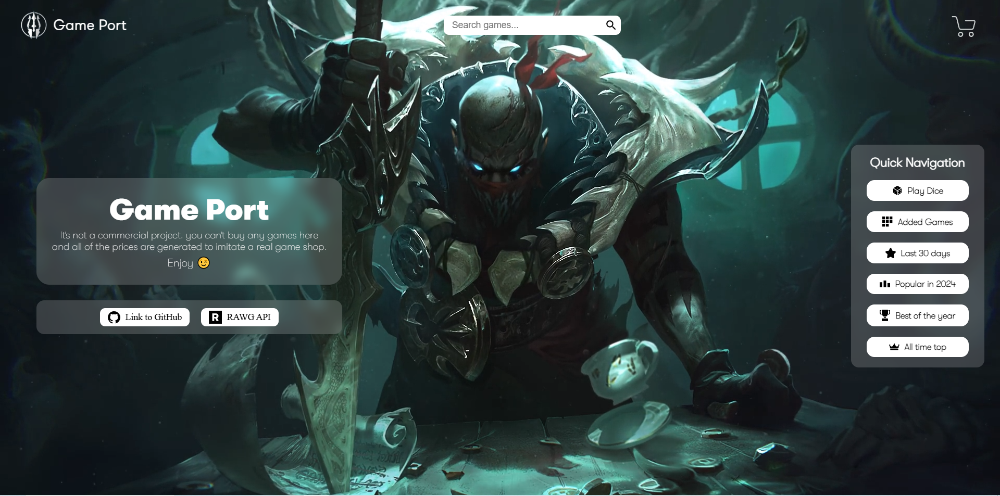
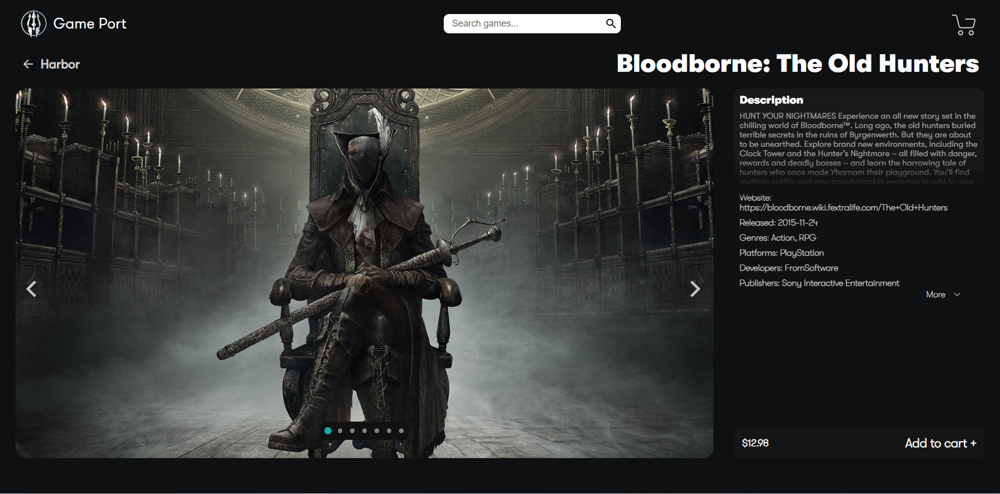
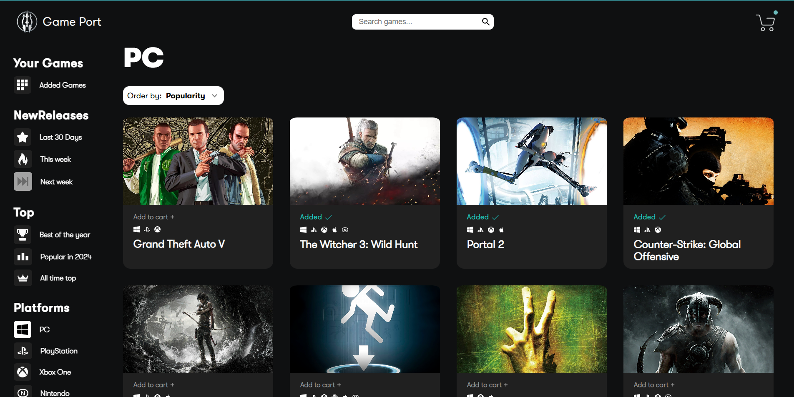
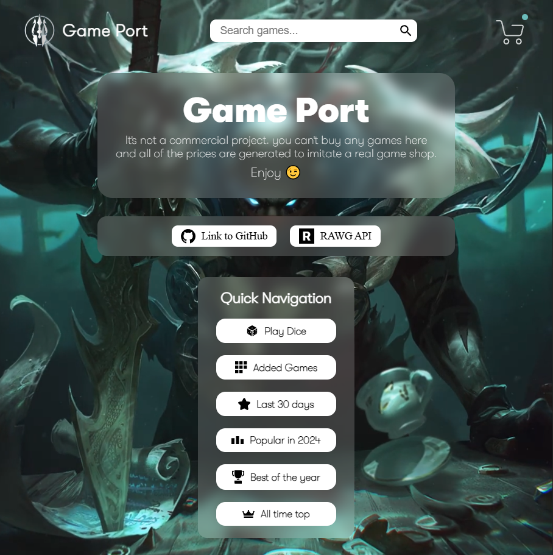
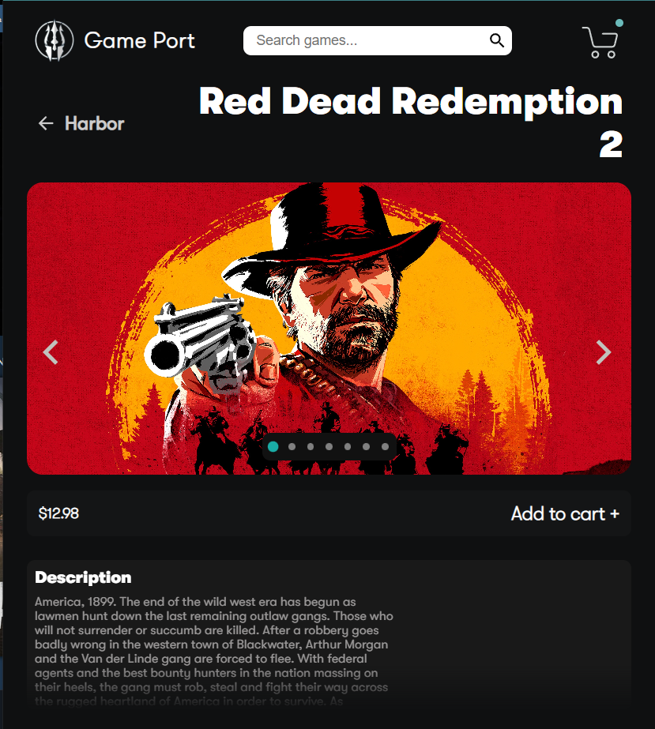
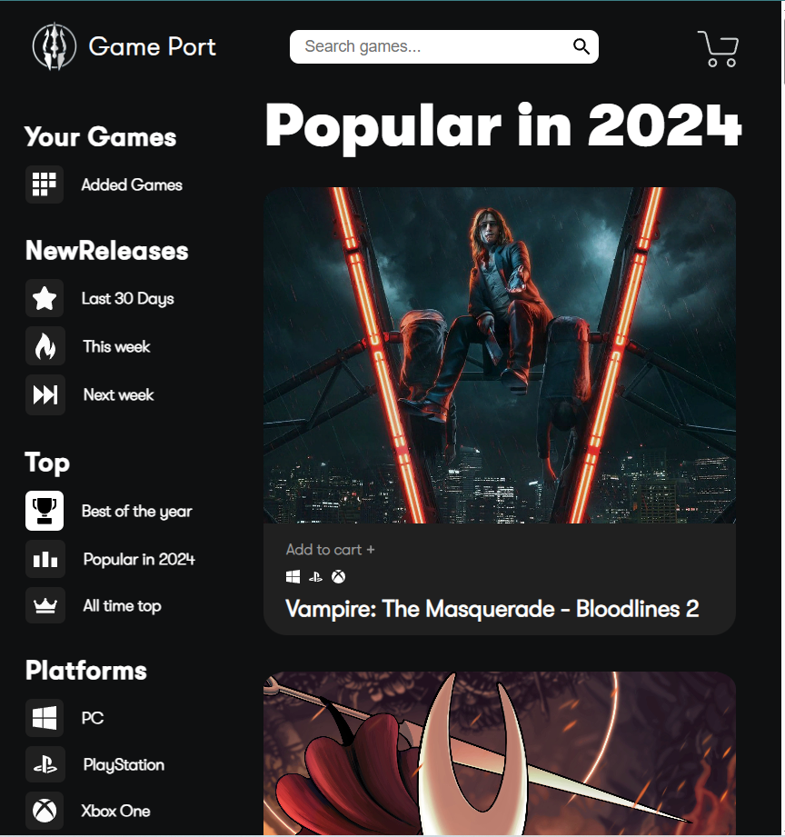

## 🔥 Demo

[Live Demo](https://shopping-cart-acykhvdau-izzabdullah223s-projects.vercel.app/)

---

## 🛠 Built With

### Front-End
- React
- Redux Toolkit
- TypeScript
- Styled-Components
- RAWG API

### Back-End
- Node.js
- Express
- PostgreSQL

#Note backend is not fully implemented
---

##  Features

- Extensive catalog of games thanks to the [RAWG API](https://rawg.io/apidocs).
- Search any game you want (Not yet implemented).
- View game details and screenshots.
- Fully responsive design.
- Filter by genre or release date.
- Cart system for games the user wants to ‘buy’.

---

## 📸 Screenshots

Large screens:

Small screens:

